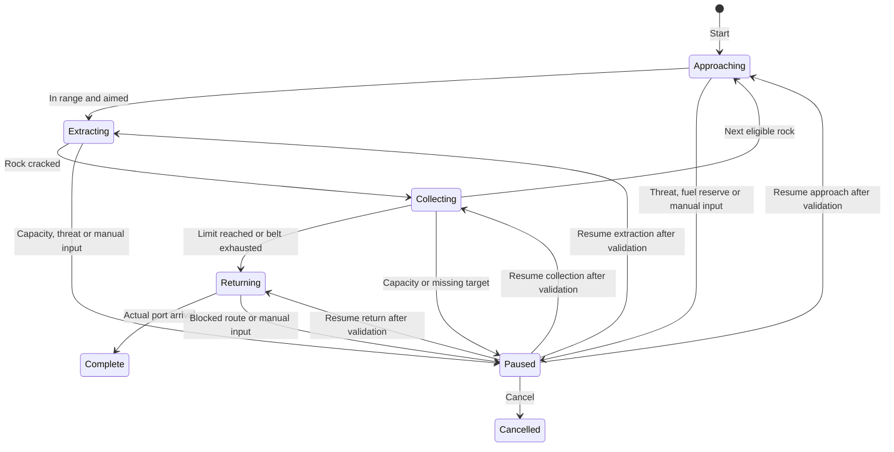

# Industry orders: implementation plan

September 12, 2026. Proposed work after v0.278.0. M433, M434 and M435 are not
implemented. This plan builds on the released workshop and mining systems.

## Existing owners and constraints

| State or operation | Current owner | Required extension |
| --- | --- | --- |
| Rock ore, extraction progress and remains | `AsteroidDef` in `src/world.ts` | A persistent target identity for orders. Current map ids use `rock:<array index>`. |
| Mineral composition and collection | `src/core/mining.ts` | Reuse `rockMaterials`, `crackRock` and `collectRock`; do not award a second abstract yield. |
| Beam extraction and physical collection | `src/scenes/flight/ai.ts` | One command path for manual and ordered mining, with a validated target. |
| Local travel and stopping | `FlightScene.startAutopilot`, `apTarget`, `updateAutopilot` | Orders observe actual arrival; they do not assign positions or declare arrival on elapsed time. |
| Local target display | `src/scenes/systemmap.ts` | Keep inspected, plotted and actively worked targets distinct. |
| Cargo at a station | `player.storage[stationId]` | Separate material storage and exact transfers without conflating cargo and material limits. |
| Research and production | `src/core/workshop.ts` | Continue using recipe checks and completion settlement. Do not add a second recipe engine. |
| Voyage clock and paused readers | `src/core/runtime.ts` | Orders respect pause and scene ownership. No offline production or mining accrual. |

Asteroids currently have coordinates and a sprite seed but no explicit id.
Introduce an optional persisted id and hydrate old saves deterministically from
the system and original array position. Preserve assigned ids after filtering
or insertion. A missing target stops the order; it must not select a different
rock that occupies the old array position.

Current extraction selects a rock within 90 metres and an aim cone. Collection
has separate material and cargo ranges: without a collector, materials need
less than 90 metres and cargo less than 35; a collector extends both to less
than 240. Core rocks require a seismic charge. An order must display and obey
these same rules. The initial automatic beam order should reject a core rock
with a clear explanation instead of repeatedly firing at it.

## M433: mining orders

Deliver one active order on the currently flown ship first. The command takes
an explicit rock or bounded belt selection, the assigned hull identity, a
return station, fuel reserve and finite collection limit. A belt order selects
the next eligible real rock only after completing the previous target.

The saved record should contain identity, phase, current target, return port,
limits, pause reason, the phase to resume and the last completed action. Ore, cargo, material counts
and ship position stay in their existing owners. A derived progress display
must not become another copy of those quantities.

Manual movement, N, a new plotted journey, hull transfer, towing and entering a
different system must have explicit order behavior. Prefer pausing with a
reason and requiring Resume. A tow must not silently become a mining run.
Reload retains the order and deposits but resumes paused, after validating the
ship, target, storage and return route.

Capacity checks precede extraction and each collection transfer. If one mineral
is full, show its exact name, current count and limit, the remains left at the
rock, and the relevant Workshop recipes. A full hold can return the ship to its
chosen port; return must not imply a sale or discard. Cancellation preserves
partial ore, all remains and collected goods.

The order panel needs Start, Pause, Resume and Cancel, with the current phase,
destination, reserve, remaining limit, inventory totals and next action. The
map and flight HUD read this record. Opening its full details pauses the voyage.
Inactive owned ships need their own persisted physical simulation and cargo
owner before they can accept these orders. Do not use charter credit payouts
as a substitute for mining actual deposits.

Acceptance includes start without motion while merely inspecting, manual
takeover, aim/range gating, two rocks with different composition, depleted and
removed targets, core rejection, a full cargo hold, one full mineral, hostile
interruption, fuel reserve, towing, hull change, save/load in every phase,
return to a moving station, and repeated arrival without duplicate transfers.

## M434: cargo logistics

First add manual port material storage and explicit batch transfers. Keep
material storage separate from existing commodity storage. Each transfer
validates source quantity, destination capacity, station access and positive
integer amount immediately before moving both balances in one operation.
Persist the source and destination together. A failed or repeated command must
not create a partial transfer or extra goods.

Next add finite transport orders between owned stores. Each order identifies
its ship, source, destination, manifest, fuel/supply reserve and trip limit.
Loading assigns goods to the ship; unloading assigns them to the destination.
Goods in transit must never remain available for production at the source.
Cancellation or a full destination leaves goods aboard, with a visible remedy.

Only after a single trip passes should repeat runs become available. Cap the
trip count and stop on missing stock, unavailable station, threat, fuel reserve
or full destination. Show the last actual delivery and current blocker. Port
rendering remains read only and must not generate a receipt or payment.

Acceptance uses two stores and one ship, then competing production and
transport requests for the same ingredients. Save/load before loading, during
travel and after unloading must conserve totals. Include a full destination,
cancelled run, changed station control, destroyed or transferred ship, and a
repeat command issued twice. Every retained unit must have exactly one owner.

## M435: experimental technology

Add specialist research through the existing technology parent/cost model.
Each prototype states its bill of materials, prerequisite research, eligible
hulls, effect and field trial before starting. Research, fabrication and
logistics must use the same available stock checks; completing one can leave
the others waiting, but cannot overspend the same ingredients.

Persist field trial progress against the installed prototype identity. Trial
credit comes from actual mining, travel, repair or support actions. Repeated
readers, save/load and unrelated equipment cannot advance a trial. Define
cancellation and unfitting recovery before introducing an item with sunk rare
materials. Existing modules and engineering grades remain useful alternatives.

Acceptance follows a complete rare salvage to storage to research to prototype
to field trial journey, with failures at every handoff. Verify costs, returned
items, installation limits, old saves, repeated completion and local resume
while cloud service is unavailable. Balance should be reviewed after players
have used the basic mining and transport orders.

## Release sequence

1. Close the known portrait menu readability issue and obtain M421 uncoached
   acceptance. Keep physical device results separate from simulated inputs.
2. Run the M427 journey matrix and native two-hour session. Existing six-hour
   simulation and strategy soaks do not satisfy native session acceptance.
3. Release M433 target identity and a complete active-ship order, then validate
   any expanded ship assignment before presenting it as available.
4. Release manual material storage, then one M434 delivery, then bounded repeat
   orders. Keep each stage independently usable and migration-safe.
5. Release M435 one specialist path at a time after logistics acceptance.

Every release needs source tests, save migration checks, browser playtests,
the exact main commit and tag, successful CI and container publication, and
matching hosted assets. Record blocked acceptance instead of treating a passed
build as a substitute for player or device evidence.
